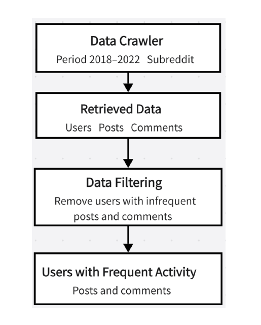
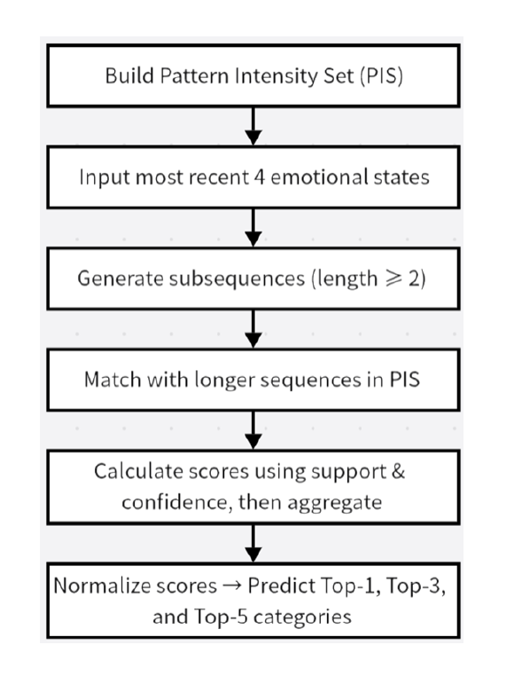

# Social Media Emotion Transition Analysis and Prediction

## 日本語概要

本プロジェクトは、Redditのユーザー投稿データを対象に、テキスト感情分類、時系列分割、感情遷移パターンの抽出を行い、過去の感情変化から将来の感情傾向を予測するデータ分析プロジェクトです。

大学院研究として実施した内容を、ポートフォリオ向けに整理したものです。

## Overview

This project analyzes Reddit user post data to identify emotional transition patterns over time and predict future emotional tendencies based on previous emotional changes.

The project includes text preprocessing, time-series segmentation, sequential pattern mining, emotion transition visualization, and Top-k emotion prediction.

## Technologies

- Python
- Pandas
- NumPy
- Scikit-learn
- Matplotlib
- Sankey Diagram
- Sequential Pattern Mining

## My Role

- Collected and preprocessed Reddit user post data
- Designed the 15-day time-window structure
- Converted user posts into emotion sequences
- Implemented sequential pattern mining
- Calculated Support, Confidence, and Sequential Confidence
- Built a ranking-based future emotion prediction method
- Visualized emotional transition flows using Sankey diagrams
- Evaluated prediction results with Top-1, Top-3, and Top-5 accuracy

## Key Features

- Reddit post data preprocessing
- 15-day user activity extraction
- 3-day time-window segmentation
- Emotion sequence construction
- Sequential pattern mining
- Future emotion Top-3 prediction
- Sankey diagram visualization
- Basic model evaluation

## Workflow

1. Collect Reddit post data
2. Clean and filter user records
3. Extract emotional features from post text
4. Divide user activity into 3-day time windows
5. Convert emotional changes into sequences
6. Mine frequent emotional transition patterns
7. Predict future emotional categories
8. Visualize emotion flows with Sankey diagrams
9. Evaluate prediction performance

## Target Positions

This project is especially relevant to the following roles:

* Data Analyst
* Python Developer
* AI / Machine Learning Assistant
* Research and Development Assistant
* Data Visualization Engineer
* NLP-related Assistant Engineer

---

## Background

Social media posts often reflect changes in users' emotional states over time.
Instead of analyzing each post independently, this project focuses on **temporal emotional transitions**.

The main goal of this project is to analyze how users' emotions change across time windows and to explore whether future emotional tendencies can be predicted from previous emotional transition patterns.

This project was developed as part of my master's research at Keio University and has been reorganized as a portfolio project for job applications.

---

## Time-Series Segmentation

For each user, the most active 15-day posting period was selected.
The 15-day period was divided into five 3-day windows.

| Window | Period    |
| ------ | --------- |
| W1     | Day 1–3   |
| W2     | Day 4–6   |
| W3     | Day 7–9   |
| W4     | Day 10–12 |
| W5     | Day 13–15 |

For each 3-day window, representative emotional categories were extracted from the user's posts.

Example:

```text
W1 → W2 → W3 → W4 → W5
Positive → Neutral → Negative → Negative → Positive
```

This sequence represents the user's emotional transition pattern over time.

---

## Emotion Sequence Construction

Each user's posts were converted into emotion sequences based on the extracted emotional categories.

Example sequence:

```text
[Positive, Neutral, Negative, Negative, Positive]
```

The project tested different levels of emotional category grouping, including:

* 3-category scheme: Positive / Negative / Neutral
* 5-category scheme
* 8-category scheme
* 12-category scheme

This made it possible to compare prediction performance under different levels of emotional granularity.

---

## Sequential Pattern Mining

Sequential pattern mining was used to extract frequent emotional transition patterns from user-level emotion sequences.

For each pattern, the following indicators were calculated.

### Support

Support measures how frequently a pattern appears in the entire dataset.

```text
Support = Pattern Count / Total Sequence Count
```

### Confidence

Confidence measures how likely a transition pattern appears after its starting emotional category.

```text
Confidence = Pattern Count / First Emotion Count
```

### Sequential Confidence

Sequential Confidence measures how likely the next emotion appears after a specific prefix sequence.

```text
Sequential Confidence = Pattern Count / Prefix Count
```

These indicators were used to evaluate the strength of emotional transition patterns.

---

## Prediction Method

The prediction task was designed to estimate the next emotional category based on previous emotional transitions.

For example, given the following recent emotional sequence:

```text
[Positive, Neutral, Negative, Negative]
```

The model predicts possible next emotional categories as a ranking:

```text
Top 1: Negative
Top 2: Neutral
Top 3: Positive
```

The prediction score was calculated based on pattern frequency, confidence, sequence length, and transition distance.

The final output was a ranked list of possible future emotional tendencies.

---

## Visualization

### Data Pipeline

The following figure shows the data collection, organization, and filtering process used in the original research.



### Prediction Workflow

The following figure shows the prediction workflow based on the Pattern Intensity Set (PIS).



## Repository Structure

```text
emotion-transition-analysis/
├── README.md
├── requirements.txt
├── src/
│   ├── feature_extraction_demo.py
│   └── demo.py
├── sample_data/
│   ├── sample_posts.csv
│   ├── sample_window_features.csv
│   └── sample_patterns.csv
└── results/
    ├── extracted_window_features_demo.csv
    ├── demo_output.txt
    └── evaluation_summary.csv

## How to Run

This repository provides two simplified demos based on the research workflow.

### 1. Feature Extraction Demo

This demo shows how sample posts are divided into five 3-day windows and converted into window-level emotional features.

```bash
python src/feature_extraction_demo.py
```

Input:

```text
sample_data/sample_posts.csv
```

Output:

```text
results/extracted_window_features_demo.csv
```

### 2. Prediction Demo

This demo predicts the next emotional state from a prepared sequential pattern table.

```bash
python src/demo.py
```

Input:

```text
sample_data/sample_patterns.csv
```

Example output:

```text
Current emotion sequence:
friends -> work -> pain -> death

Predicted next emotions:
Top 1: healing | score = 0.3580
Top 2: optimism | score = 0.1480
```

### Install Dependencies

```bash
pip install -r requirements.txt
```

## Code and Data Availability

This repository is a portfolio version of my master's research project.

The full research project used large-scale Reddit data from 2018 to 2022 and included Reddit data extraction, text preprocessing, user cohort filtering, most-active 15-day period selection, 3-day window segmentation, Empath-based emotion feature extraction, sequential pattern mining, PIS construction, and Top-k emotion prediction.

Due to data size, privacy considerations, and dataset usage restrictions, the original Reddit dataset and full experimental pipeline are not included in this repository.

Instead, this repository provides simplified and reproducible demo files:

- `src/feature_extraction_demo.py` demonstrates how sample posts are converted into five 3-day window-level emotional features.
- `src/demo.py` demonstrates how prepared sequential pattern data can be used for Top-k next emotion prediction.
- `sample_data/` contains small artificial sample data for demonstration.
- `results/` contains actual outputs from the demo scripts and selected evaluation results from the original research.

The simplified demos are designed to show the core workflow and logic of the research in a compact, readable, and runnable form.


## Notes

The original Reddit dataset is not included due to data privacy and usage restrictions.

This repository provides a simplified portfolio version of the research project.
